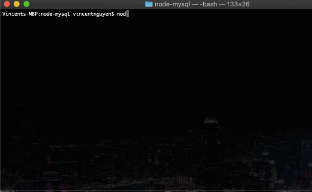
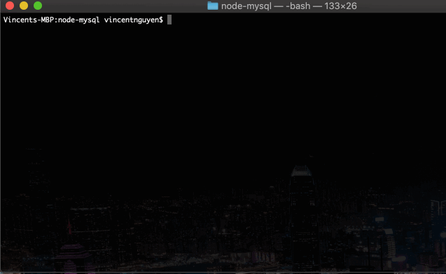

# Ecommerce CLI Store Front & Management (Node.js & MySQL)

An Amazon-like storefront built with Node.js & MySQL. 

The app will:
- Take in orders from customers and deplete stock from the store's inventory.
- Track product sales across store's departments and provide a summary of the highest-grossing departments (total profits) in the store.
- Add and create new products and departments.


## Setup & Requirements
- `git clone <repo>`.
- `npm install`.
- Create mock database using `bamazon.sql`.
- Configure MySQL connection in `bamazonCustomer.js`, `bamazonManager.js`, `bamazonSupervisor.js`.
- Connection sample:

```javascript
var mysql = require('mysql');
...

 // create connection to mysql
 var connection = mysql.createConnection({
    host: 'localhost',
    port: 8889,
    user: 'root',
    password: 'root',
    database: 'bamazon'
});
```

> Make sure you save and require the MySQL, Inquirer, and cli-table npm packages--your app will need them for data input and storage.

## Application
- Run in terminal/bash: `node <filename.js>`.

#### Store Front - Customer View


#### Management - Manager View


#### Management - Supervisor View


## Technologies:
- Node.js
- MySQL
- `npm inquirer`
- `npm cli-table`
